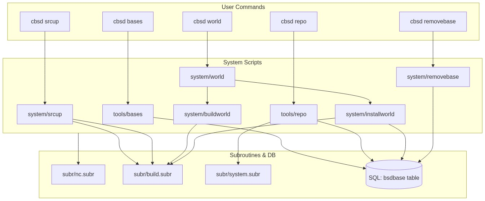

# Walkthrough: CBSD Codebase Analysis

I have completed the analysis of the CBSD codebase to assist in updating the project documentation.

## Key Accomplishments

### 1. Codebase Mapping
- Identified the core of the project: a customized shell (`cbsdsh`) that provides built-in commands for virtualization management and SQLite integration.
- Mapped out the control script directories (`jailctl`, `bhyvectl`, etc.) and identified the shared library system in `subr/`.
- Explored the extensive configuration ecosystem in `etc/defaults/`, which supports a wide range of operating systems.

### 2. Documentation Audit
- Located the primary documentation fragments in `share/docs/`, organized by subsystem (e.g., `jail`, `bhyve`, `general`).
- Identified the limited scope of the current manual pages in `man/`.
- Found platform-specific READMEs and the main `README.md`.

### 5. Base Command Dependencies
I have mapped the relationships between the CLI commands, their implementation scripts, and the underlying subroutines.

### 6. Gap Identification
- **Man Pages**: Identified that many individual commands in `jailctl` and `bhyvectl` lack dedicated man pages.
- **Reference Documentation**: Noted that the `etc/defaults/` files could benefit from a centralized reference guide.
- **Module Documentation**: Verified that while some modules have documentation fragments, others may be less documented.

## Documents Produced
- [Codebase Analysis Report](CODEBASE_ANALYSIS.md): A detailed breakdown of the project architecture and documentation system.
- [TODO_dsewell.MD](TODO_dsewell.MD): A checklist of identified documentation improvements.

## Conclusion
The CBSD project is a mature and complex system with a unique architecture centered around a custom shell. The documentation is currently spread across READMEs, manual pages, and markdown fragments. The analysis highlights specific areas where the documentation can be expanded or centralized.
